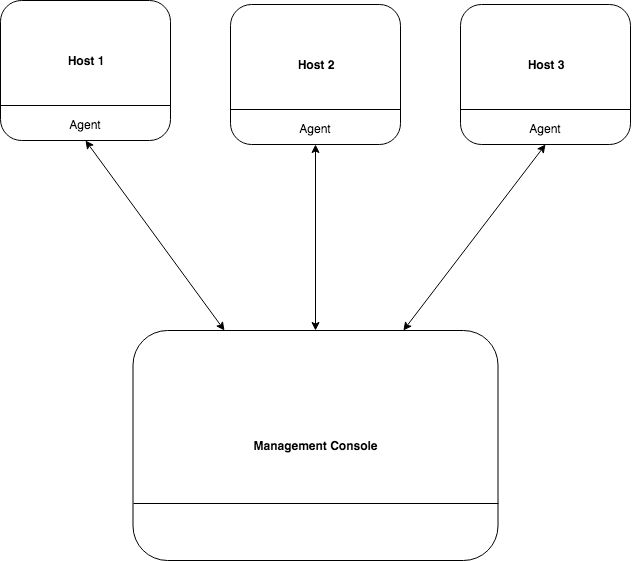

# UMUC Group Project
This project will be completed as part of the CMSC 495 - Current Trends and Projects in Computer Science course.

# Service Beacon
Service Beacon is a server software that is install as an agent to track updgrade and pathch status of running programs of its host. 
Using a management console web application the administrator is able to view all server host that have a Service Beacon agent installed and can view all running programs on each hosts with updgrade and pathch status.

# Team
Coulibaly, Souleymane <bina.coulibaly@gmail.com>

Fairley, Kyle <vashun914@yahoo.com>

Richard, Jason <jlrichard1978@gmail.com>

Seymour, Noah <jackjack178@gmail.com>

Turner, Daniel <dnlturner4@gmail.com>
